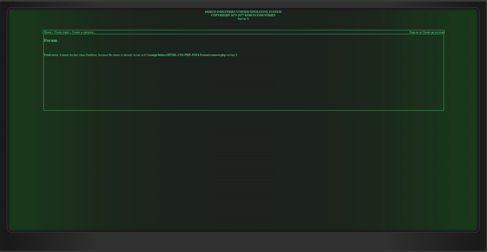

# HTML-CSS-PHP-JS
HTML, CSS, PHP &amp; JS Projecten

📁 Beroepsproject 2 - Blog
    - Een blog met een backend die blog posts kan toevoegen, verwijderen en bewerken als je een admin bent.

📁 F4-forum
    - Een forum met een backend die topics en categorien kan toevoegen, verwijderen en bewerken.

    

    De code is al wel flink verouderd en ook niet veilig tegen SQL-injecties.
    Dit was een van de eerste websites die ik had gemaakt had en bewaard is gebleven, met de datum erbij van 2016 - 2018.
    Hij heeft het ooit wel helemaal gedaan maar nu ik er weer naar keek al die jaren later, is het een beetje een puinhoop.
    het uiterlijk dat nog wel goed neergezet wordt ziet er nog heel mooi uit, de meeste andere webpaginas die ik local maak zien er ineens heel anders uit wanneer ik hem online zet.